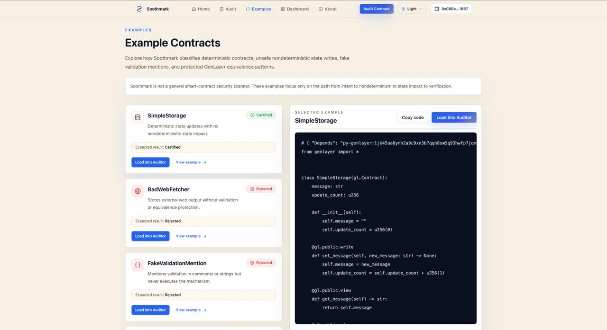

# Soothmark

Soothmark is a GenLayer-native intelligent contract auditor that checks whether contract code uses the right validation/equivalence mechanism before AI, web data, API results, or rendered page content can affect on-chain contract data.

Soothmark helps GenLayer builders check if AI or fetched web data is properly validated before it changes what their contract stores.

Soothmark traces one critical path: intent → nondeterminism → state impact → validation/equivalence → result.

---

## Live Demo

[soothmark.xyz](https://soothmark.xyz)

Soothmark is live as a Bradbury testnet demo. The app connects to a deployed GenLayer intelligent contract, lets users submit GenLayer contract code for audit, and reads structured audit reports back from GenLayer contract state.

### How the Live Flow Works

Live workflow:

1. A user connects a wallet.
2. The user submits GenLayer contract code for audit.
3. The Soothmark intelligent contract runs the audit through GenLayer's leader/validator workflow.
4. The audit result is stored in contract state.
5. The frontend reads the report and wallet-scoped dashboard data back from GenLayer.

The current testnet release keeps validator checks lightweight to reduce timeout risk, while the leader performs the full Soothmark audit reasoning.

---

## The Vision

As a developer building on GenLayer, I saw that intelligent contracts introduce a new kind of risk.

Traditional smart contract review is not enough on its own, because GenLayer contracts can use web data, AI output, rendered pages, and other nondeterministic inputs. The hard question is not only "does this code run?" It is also "can this AI or fetched web data change on-chain contract data without the right validation or equivalence check?"

From my own developer experience, and from conversations with other builders working around GenLayer, it became clear that people needed a focused tool for this exact problem.

Soothmark was built to make this review visible, structured, and repeatable.

---

## What Soothmark Is

Soothmark is a focused auditor for GenLayer intelligent contracts.

Soothmark is a GenLayer-native intelligent contract auditor that checks whether contract code uses the right validation/equivalence mechanism before AI, web data, API results, or rendered page content can affect on-chain contract data.

Soothmark helps GenLayer builders check if AI or fetched web data is properly validated before it changes what their contract stores.

Soothmark traces one critical path: intent → nondeterminism → state impact → validation/equivalence → result.

```text
Intent -> Nondeterminism -> State Impact -> Verification Check -> Result
```

- **Intent:** What the contract is trying to do.
- **Nondeterminism:** Whether the contract uses AI, web, render, or other unpredictable external inputs.
- **State Impact:** Whether that nondeterministic output can affect on-chain contract data.
- **Verification Check:** Whether the correct GenLayer validation/equivalence mechanism protects that path.
- **Result:** Certified, Conditional, or Rejected.

---

## Current App Status

Soothmark is live at [soothmark.xyz](https://soothmark.xyz) with a working end-to-end Bradbury testnet audit flow: a user can connect a wallet, submit a GenLayer contract, wait for the accepted transaction flow, open the structured report, and review wallet-scoped audit history from the dashboard.

Current working pieces include:

- live deployed app
- frontend audit workspace with README screenshots
- wallet connection
- real GenLayer contract interaction
- GenLayer contract submission flow and accepted transaction handling
- polling for stored audit reports
- full audit report page
- wallet-scoped dashboard with owner-indexed reads
- examples page
- production build and lint checks
- Vercel-ready deployment configuration

Soothmark is still early, but the core audit path is in place.

---

## What It Does

Soothmark lets a user paste or load a GenLayer contract, submit it for an on-chain audit, and receive a structured audit report.

The report shows:

- contract intent
- nondeterministic behavior
- whether nondeterminism affects state
- whether validation/equivalence is properly used
- recommendations
- raw audit JSON for technical inspection

Result meanings:

- **Certified:** No unsafe nondeterministic state update was found, or the state-changing nondeterministic path is properly protected.
- **Conditional:** A validation path exists, but the audit found ambiguity or incomplete certainty.
- **Rejected:** Nondeterministic output can affect on-chain contract data without visible proper validation/equivalence protection.

---

## Key Innovations

### 1. Validation/Equivalence Focus

Soothmark is focused on one GenLayer-specific safety question:

Does contract code use the right validation/equivalence mechanism before AI, web data, API results, or rendered page content can affect on-chain contract data?

### 2. GenLayer-Native Audit Path

The audit mirrors the actual GenLayer risk path:

```text
Intent -> Nondeterminism -> State Impact -> Verification Check -> Result
```

### 3. On-Chain Audit Storage

Audit reports are stored through the Soothmark intelligent contract, making each report tied to an audit ID and wallet owner.

### 4. Wallet-Scoped Dashboard

Users see their own audit history through wallet ownership filtering, without presenting the app as a public audit explorer.

### 5. Structured Machine-Readable Reports

Reports use a compact JSON schema so results can be read by both humans and tools.

### 6. Focused Certification Language

Soothmark avoids fake broad scores and instead returns Certified, Conditional, or Rejected based on the exact validation/equivalence path.

---

## Technical Pillars

### GenLayer Intelligent Contract Backend

The Soothmark backend is an intelligent contract that receives submitted contract code and produces a structured audit result.

### Leader and Validator Review

Audit reasoning runs through GenLayer's leader/validator model using nondeterministic execution and validator agreement.

### Minimal, Focused Schema

Reports use a small schema built around:

- `classification`
- `intent`
- `nondeterminism`
- `state_impact`
- `validation`
- `recommendations`

### Frontend Audit Workspace

The frontend is built with:

- Next.js
- TypeScript
- Tailwind
- wallet connection
- GenLayer client adapter
- dashboard and report pages

### Wallet-Scoped Audit Retrieval

Soothmark stores audit reports by audit ID and also tracks audit IDs by owner wallet. The dashboard uses this owner index to load a wallet's audit records without scanning the full global audit count.

### Production-Oriented UX

Soothmark uses a light-first Luminous Audit Workspace design with clean audit states, report-first presentation, raw JSON hidden by default, and debug logs controlled by `NEXT_PUBLIC_SOOTHMARK_DEBUG`.

---

## GenLayer Methods Used

### `gl.vm.run_nondet_unsafe`

Used to run the audit reasoning path through GenLayer's leader/validator model. The leader proposes the structured audit result. The current testnet release keeps validator checks lightweight to reduce timeout risk, so validators reject malformed results or invalid classifications while the leader performs the full Soothmark audit reasoning.

Soothmark does not use ordinary Python helper logic to decide audit facts. The audit reasoning is intended to happen through GenLayer's nondeterministic execution and validator verification path.

### `gl.message.sender_address`

Used to associate each submitted audit with the wallet address that submitted it. This powers wallet-scoped audit history in the dashboard.

### `TreeMap`

Used for persistent contract storage:

- audit ID -> audit report JSON
- audit ID -> owner address
- owner wallet -> audit ID list

This keeps audit reports retrievable by ID and lets the frontend load dashboard records through wallet-scoped audit indexing.

### `u256`

Used for the audit counter so each submitted audit receives a stable incremental audit ID.

### JSON serialization

Audit reports are stored as JSON strings so the frontend can retrieve, normalize, and render structured reports consistently.

---

## UI Tour

### 1. Landing Page


The landing page introduces Soothmark's focused audit scope and gives users a clear place to start an audit.

### 2. Audit Workspace


Users paste or load a GenLayer contract, connect their wallet, and submit the contract for an on-chain audit.

### 3. Audit In Progress


After submission, Soothmark tracks the transaction and waits for the audit report to become available from the contract.

### 4. Audit Report


The report shows the audit result, verdict, intent, nondeterminism, state impact, Verification Check, recommendations, and optional raw JSON.

### 5. Dashboard


The dashboard gives users a wallet-scoped history of their own audits and lets them reopen individual reports.

### 6. Examples



The examples page gives users focused GenLayer contract samples for testing Soothmark's audit path.

---

## Audit Scope

Soothmark checks:

- executable nondeterministic logic
- nondeterministic state impact
- validation/equivalence coverage
- whether the protection matches the state-changing path

Soothmark does not check:

- general protocol vulnerabilities
- gas optimization
- frontend security
- broad code quality
- full protocol correctness
- every possible business logic bug

---

## Result Types

| Result      | Meaning                                                                                              |
| ----------- | ---------------------------------------------------------------------------------------------------- |
| Certified   | The audit found no unsafe nondeterministic state update, or the relevant path is properly protected. |
| Conditional | A validation path exists, but coverage or tightness is unclear.                                      |
| Rejected    | Nondeterministic output can affect on-chain contract data without proper validation/equivalence protection. |

---

## Configuration & Environment Setup

Copy the example environment file for local development:

```bash
cp .env.example .env.local
```

Set only frontend-safe `NEXT_PUBLIC_*` values. Do not commit `.env.local`, and do not add private keys, seed phrases, mnemonics, or backend secrets. Vercel must receive the same public environment variables for deployment.

```env
NEXT_PUBLIC_WALLETCONNECT_PROJECT_ID=
NEXT_PUBLIC_SOOTHMARK_CONTRACT_ADDRESS=
NEXT_PUBLIC_SOOTHMARK_CHAIN=testnetBradbury
NEXT_PUBLIC_SOOTHMARK_RPC_ENDPOINT=https://rpc-bradbury.genlayer.com
NEXT_PUBLIC_SOOTHMARK_RECEIPT_STATUS=ACCEPTED
NEXT_PUBLIC_GENLAYER_EXPLORER_URL=https://explorer-bradbury.genlayer.com
NEXT_PUBLIC_SOOTHMARK_USE_MOCKS=false
NEXT_PUBLIC_SOOTHMARK_ENABLE_GLOBAL_AUDIT_SCAN=false
NEXT_PUBLIC_SOOTHMARK_DEBUG=false
```

| Variable                                       | Purpose                                                                       |
| ---------------------------------------------- | ----------------------------------------------------------------------------- |
| `NEXT_PUBLIC_WALLETCONNECT_PROJECT_ID`         | WalletConnect/Reown project ID used by the wallet provider.                   |
| `NEXT_PUBLIC_SOOTHMARK_CONTRACT_ADDRESS`       | Deployed Soothmark intelligent contract address.                              |
| `NEXT_PUBLIC_SOOTHMARK_CHAIN`                  | GenLayer chain target, currently `testnetBradbury`.                           |
| `NEXT_PUBLIC_SOOTHMARK_RPC_ENDPOINT`           | RPC endpoint used to communicate with GenLayer.                               |
| `NEXT_PUBLIC_SOOTHMARK_RECEIPT_STATUS`         | Receipt status expected before the frontend treats a transaction as accepted. |
| `NEXT_PUBLIC_GENLAYER_EXPLORER_URL`            | Explorer base URL used to build transaction links.                            |
| `NEXT_PUBLIC_SOOTHMARK_USE_MOCKS`              | Enables/disables mock mode; should be `false` for deployment.                 |
| `NEXT_PUBLIC_SOOTHMARK_ENABLE_GLOBAL_AUDIT_SCAN` | Controls global audit scanning; should remain `false` for wallet-scoped UX. |
| `NEXT_PUBLIC_SOOTHMARK_DEBUG`                  | Enables Soothmark debug logs when set to `true`.                              |

---

## Local Development

Install dependencies:

```bash
pnpm install
```

Start the local app:

```bash
pnpm dev
```

Then add your own public WalletConnect/Reown project ID in `.env.local`.

---

## Deployment

The frontend can be deployed on Vercel from GitHub.

1. Push the repo to GitHub.
2. Import the project into Vercel.
3. Choose the repository root as the root directory.
4. Add the required environment variables.
5. Deploy.

Useful verification commands:

```bash
pnpm lint
pnpm build
```

---

## Planned Features

### Shareable Audit Reports

A future version may allow users to generate controlled share links for specific audit reports, making it easier to share audit results with teammates, reviewers, or hackathon judges without adding global discovery.

### Stronger Validator Verification Mode

A future version may add a stricter validator mode for deeper equivalence checks once timeout behavior is better characterized.

### Richer Report Metadata

Future reports may include cleaner metadata, stronger contract-size guidance, and better audit comparison examples while keeping the core audit path focused.

---

## Project Status

Soothmark is a current testnet release focused on GenLayer validation/equivalence review for nondeterministic state impact.

---

## License

License to be added.
